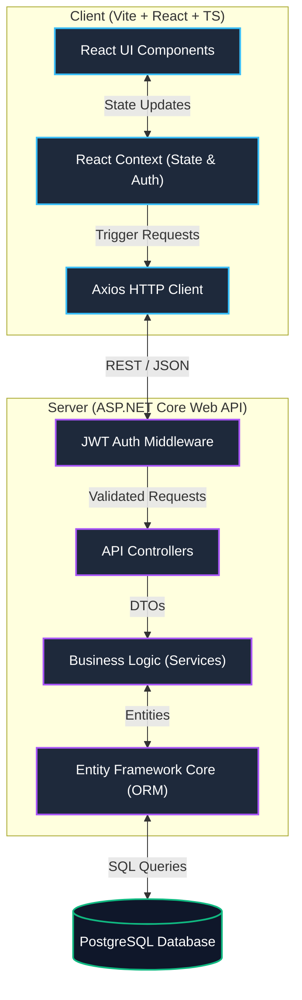
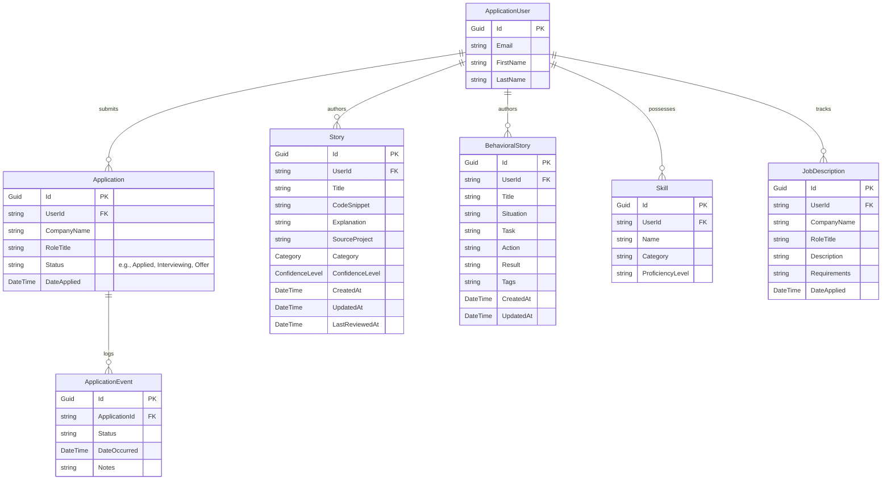

<div align="center">
  
# Precept

**A Private, Containerized Job-Hunting Command Center for Software Engineers**


Precept is a highly specialized Career OS designed strictly for developers. It moves beyond standard spreadsheets by introducing a localized system to manage STAR (Situation, Task, Action, Result) stories, track applications, and index technical skills, all behind a sleek, developer-first interface.

</div>

---

## 🚀 Why Precept?

Standard CRMs and spreadsheets are clunky and generalized. Precept was built to solve a specific pain point for software engineers: **organizing interview narratives and tracking the job hunt pipeline in an environment that feels like home.**

- **Technical Story Bank**: Catalog code snippets, explanations, and source projects by category (Auth, Database, AI/ML, DevOps, etc.) with confidence-level tracking so you can identify weak spots before an interview.
- **Behavioral Story Bank**: Curate STAR-method narratives (Situation, Task, Action, Result) with tagging so you never freeze during a behavioral round.
- **JD Analyzer**: Paste a job description and manually map its requirements against your stories and skills to identify coverage gaps before an interview.
- **Pipeline Tracking & True Trajectory Scanner**: A centralized dashboard to track active applications. Automatically logs historical pipeline events (status changes) so you have an exact, real-time timeline of your job hunt trajectory.
- **Analytics & Insights Dashboard**: Visual representations of your job search progress, skill gaps, and application conversion rates using dynamic radar and bar charts.
- **Skills Matrix**: Keep an up-to-date inventory of your technical capabilities and proficiencies to quickly match against job descriptions.
- **Containerized Architecture**: Your career data is highly personal. Precept leverages a containerized PostgreSQL database to ensure your pipeline remains private, fast, and completely under your control.
- **Developer-First Aesthetics**: A dark-mode, command-center UI built with TailwindCSS, Framer Motion, and Liquid Glass elements that developers actually _want_ to use.

---

## 🏗️ System Architecture

Precept follows a clean, decoupled client-server architecture, allowing for independent scaling and local deployment.



### Tech Stack

#### 🟢 Backend (Precept.Api) — **[LIVE: R1]**

- **Framework**: ASP.NET Core Web API (.NET 10)
- **Language**: C#
- **ORM**: Entity Framework Core
- **Database**: PostgreSQL (Docker Container)
- **Authentication**: JSON Web Tokens (JWT) & ASP.NET Core Identity

#### 🟢 Frontend (Precept.Web) — **[LIVE: R1]**

- **Framework**: React 19 with TypeScript
- **Build Tool**: Vite (Lightning fast HMR)
- **Styling**: TailwindCSS v4 with custom design system tokens
- **Animations**: CSS keyframe animations (glassmorphic transitions, pulse glows)
- **Data Visualization**: Recharts for dynamic, responsive dashboard analytics
- **Icons**: FontAwesome 6
- **State Management**: React Context API
- **Routing**: React Router DOM

---

## 🛠️ Data Model Overview

The system revolves around five core domain entities tailored to the engineering job hunt:



---

## ⚙️ Local Development Setup

To run Precept locally, you'll need [Docker Desktop](https://www.docker.com/products/docker-desktop/) (or equivalent Docker engine) installed.

### 1. Clone the repository

```bash
git clone https://github.com/austinchima/precept.git
cd precept
```

### 2. Start the Stack with Docker Compose

```bash
docker compose up -d --build
```

_The API will boot and be accessible by the frontend container automatically. The frontend UI will be available on `http://localhost:3000`._

---

## 🔐 Security & Privacy

Since Precept handles your personal career trajectory, security is treated as a first-class citizen:

- **Authentication**: Short-lived JWTs paired with SHA-256-hashed refresh tokens stored exclusively in `HttpOnly`, `Secure`, `SameSite=Strict` cookies. Implements full token rotation on every refresh cycle; revoked tokens are chained to their replacements. Reuse of a stolen revoked token triggers cascade revocation across all active sessions. Includes rigorous optimistic concurrency (dead-heat) and lineage guards to prevent legitimate double-refresh actions from accidentally locking users out.
- **Containerized Isolation**: PostgreSQL keeps your data entirely localized to your machine's Docker network. No telemetry, no cloud sync unless explicitly configured.
- **Data Export**: Built-in raw JSON payload export functionality for immediate data portability.

---

## 🔮 Roadmap

Precept is constantly evolving. **Release 1 (R1)** shipped the full-stack foundation: a secure ASP.NET Core API, the React/Vite web interface, and the containerized PostgreSQL data layer. Future releases will expand the platform with intelligent automation:

### R2 — AI-Powered Interview Intelligence

- **🤖 AI Mock Interviewer**: Upload your resume and a job description URL. An LLM (OpenAI/Gemini) generates tailored behavioral and technical interview questions, scores your live responses, and provides actionable feedback — turning Precept into a personal interview coach.
- **🎙️ Voice Interview Simulation**: Real-time voice-based mock interviews using the Web Speech API for speech-to-text transcription. Practice answering under pressure with a timed, conversational interview flow that mirrors real phone screens.
- **📄 AI Resume Analyzer**: Server-side resume parsing (PDF/DOCX) that automatically extracts skills, experience keywords, and role-specific strengths. Auto-populates your Skills inventory and computes JD match scores without manual keyword entry.

### R3 — Platform Expansion

- **Cross-Platform Native Apps**: Packaging the web experience into a native **Desktop Application** (Electron/Tauri) and a companion **Mobile App**, giving you offline-first access to your interview stories and job pipeline anytime, anywhere.
- **Team Mode**: Shared story banks and peer mock interviews for engineering teams preparing together.

---

<div align="center">
  <i>Engineered for the Modern Developer.</i>
</div>
