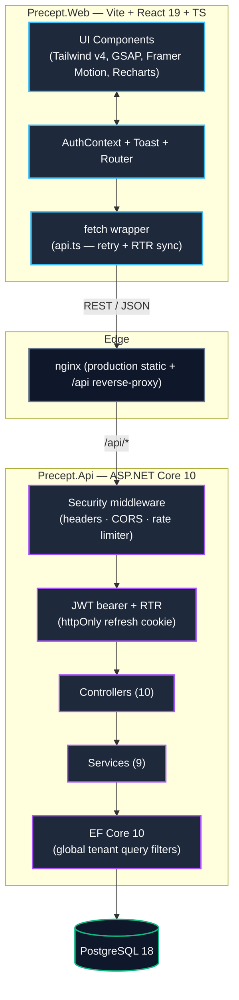
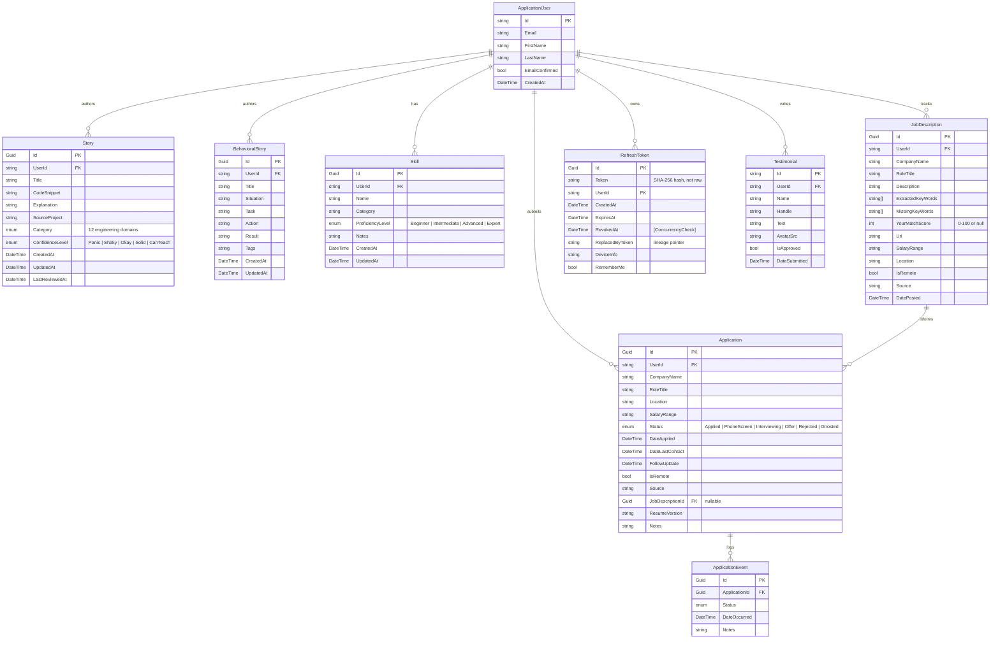

<div align="center">

# Precept

**A career command center for software engineers — story bank, drill engine, and job pipeline tracker.**


</div>

Precept is a self-hostable web application that helps software engineers prepare for interviews
and run their job hunt as a structured project rather than a graveyard of browser tabs. It is
**developer-first**: dark-mode, monospace-leaning, keyboard-shoppable, with a real security
posture and no telemetry. It is also a deliberate engineering artifact — the auth, testing, and
operational pieces are built to a higher bar than the feature surface strictly requires, by design.

> **Status:** R1 is shipped (full-stack, secure, containerized, CI-green). R2 (AI-powered
> interview intelligence) is in design — see [Roadmap](#-roadmap) for honest scope and the
> cost-engineering constraints we are committing to.

---

## ✦ Why this exists

Interview prep for engineers is fragmented across a Google Doc of STAR stories, a spreadsheet
of applications, twenty open JD tabs, and a vague mental model of "things I have built." Precept
collapses that into one application with three explicit jobs:

1. **Bank your stories** — technical (snippets + explanations, tagged across 12 engineering
   domains) and behavioral (STAR-structured) — so you walk into every round with a written corpus
   to draw from.
2. **Drill them until recall is automatic** — a Quiz Mode that rates each story on a 5-rung
   *Confidence Ladder* (`Panic → Shaky → Okay → Solid → Can Teach`) and resurfaces the right
   story next: unreviewed first, then weakest, then oldest reviewed.
3. **Run the pipeline like a project** — every application moves through a five-stage status
   machine with automatic event history, so nothing goes stale and you always know what to chase.

The wedge against other tools (Teal, Huntr, Simplify) is the **second** job. Those track
applications; Precept also makes you interview-ready.

---

## ✦ What's in R1 (live)

| Module | What it does |
|---|---|
| **Technical Story Bank** | Catalog snippets + written explanations, tagged across 12 domains: `Auth`, `Database`, `Ai`, `Ml`, `DevOps`, `Frontend`, `Backend`, `SystemDesign`, `Security`, `Testing`, `Cloud`, `Architecture`. Each story carries a `ConfidenceLevel`. |
| **Behavioral Story Bank** | STAR-method (Situation / Task / Action / Result) narratives with free-text tags. |
| **Quiz Mode** | Spaced-repetition resurfacing: never-reviewed first → low-confidence (`Panic`/`Shaky`) → oldest-reviewed. Rating a story updates `ConfidenceLevel` and `LastReviewedAt` atomically. |
| **JD Skill Mapper** | Persist a job description with a **user-supplied keyword list**; Precept computes a match score by case-insensitive set-intersection against the user's `Skills` inventory and surfaces the missing keywords. (No NLP yet — that's an R2 candidate.) |
| **Pipeline Tracker** | Five-stage status machine: `Applied → PhoneScreen → Interviewing → Offer / Rejected / Ghosted`. Every status change writes an `ApplicationEvent` for an auditable trajectory. |
| **Skills Matrix** | Inventory with `Name`, `Category`, `ProficiencyLevel` (`Beginner / Intermediate / Advanced / Expert`), and notes. Feeds the JD match. |
| **Analytics Dashboard** | Story confidence + category breakdowns, applications by status, response/rejection rates, average JD match score. Powered by `Recharts`. |
| **Search** | Cross-entity search over the user's stories, applications, JDs, and skills. |
| **Data Export** | `GET /api/dashboard/export` returns the user's entire data set as a JSON payload. No lock-in. |
| **Testimonials (landing page)** | Authenticated users can submit a public testimonial; the landing page reads from `GET /api/testimonial/public`. |

All endpoints are user-scoped (`[Authorize]` + `WHERE UserId = current_user` at the query
layer) and rate-limited.

---

## ✦ Architecture



### Tech stack — actually used

| Layer | What's in the repo |
|---|---|
| **Backend (`Precept.Api/`)** | ASP.NET Core Web API on **.NET 10**, C# 13, EF Core 10, Npgsql, ASP.NET Core Identity, JWT bearer, `System.Threading.RateLimiting`, **Serilog** (console + rolling file sink), **Scalar** for OpenAPI UI, `DotNetEnv` for local env loading. |
| **Frontend (`Precept.Web/`)** | **React 19** + TypeScript on **Vite 6**, **Tailwind v4** (`@tailwindcss/vite`), **GSAP 3** + `@gsap/react`, **Framer Motion** / **motion**, **Recharts**, **lucide-react**, **lenis** (smooth scroll), `@paper-design/shaders-react`, native `fetch` (no axios), React Router 7. |
| **Database** | PostgreSQL 18 (Alpine in compose), schema versioned via EF Core migrations (committed to git). |
| **Tests (`Precept.Tests/`)** | **xUnit** + **Testcontainers for .NET** (Postgres per-class isolation in local runs; CI uses an action-provisioned Postgres service); 52+ DB-backed integration + unit tests. |
| **CI** | GitHub Actions (`.github/workflows/ci.yml`): build + test + `dotnet list package --vulnerable` + `npm audit --audit-level=moderate` on the web project. |
| **Containerization** | Multi-stage Dockerfiles for both projects; `docker-compose.yml` wires `db` → `api` → `web` with healthchecks. |

---

## ✦ Project layout

```
.
├── Precept.Api/                ASP.NET Core 10 web API
│   ├── Controllers/            10 controllers (Auth, Story, Application, JD, Skill, ...)
│   ├── Services/               9 services + interfaces (DI-registered, scoped)
│   ├── Models/                 Domain entities + EF migrations source
│   ├── DTOs/                   Request/Response shapes
│   ├── Data/                   PreceptDbContext (with global tenant query filters)
│   ├── Migrations/             EF Core migrations (committed)
│   ├── appsettings.json        Non-secret config (secrets injected via env)
│   ├── Program.cs              Composition root + middleware pipeline
│   └── Dockerfile              Multi-stage (build / dev / final)
│
├── Precept.Web/                Vite + React 19 + TS frontend
│   ├── src/pages/              Route components (Landing, Login, Dashboard, ...)
│   ├── src/components/         UI + animation primitives
│   ├── src/lib/                animations.ts (GSAP wrappers), constants, utils
│   ├── src/api.ts              fetch wrapper with token refresh interceptor
│   ├── src/AuthContext.tsx     React context for auth state
│   ├── nginx.conf              Production reverse-proxy config (/api → api:8080)
│   └── Dockerfile              build → nginx final stage
│
├── Precept.Tests/              xUnit test suite
│   ├── Integration/            Auth, Story, Application endpoint tests
│   ├── Unit/                   Story, Application, Token, CookieOptions services
│   └── Infrastructure/         PostgresContainerFixture, WebApplicationFactory
│
├── design-system/pages/        Static design references (UI exploration)
├── .github/workflows/ci.yml    Build + test + vulnerability scans
├── docker-compose.yml          db + api + web stack
├── OWASP-SECURITY-AUDIT.md     Full A01-A10 audit, findings + remediation
├── auth_reuse_detection_cascade_revocation.md   Auth architecture handbook
└── CHANGELOG.md                Keep-a-Changelog format, semver
```

---

## ✦ Data model



---

## ✦ Security posture

Precept handles personal career data; the security model is overbuilt on purpose. The
[OWASP-SECURITY-AUDIT.md](./OWASP-SECURITY-AUDIT.md) document tracks every Top-10 category with
status and remediation notes. Highlights:

### Authentication & session management
- **Passwords** — PBKDF2 via ASP.NET Core Identity. Password policy: ≥8 chars, upper/lower/digit/non-alphanumeric.
- **Lockout** — 5 failed attempts → 15-minute lockout, enabled for new users.
- **Email** — Registration sets `EmailConfirmed=false` and issues a confirmation token; `forgot-password` / `reset-password` flows use Identity's built-in token providers (logged to console in dev, ready for an email-service hook in prod).
- **Access tokens** — JWT bearer, HMAC-SHA256, 15-minute expiry, **zero clock skew**.
- **Refresh tokens** — 64-byte CSPRNG, **only SHA-256 hashes are persisted**, set in an `HttpOnly` + `Secure` + `SameSite=Strict` cookie. Default 7-day expiry.
- **Refresh-token rotation (RTR)** — every refresh exchange invalidates the spent token and writes a new one in a single atomic `SaveChanges`. Spent tokens record their successor's hash (`ReplacedByToken`) to preserve family lineage.
- **Replay defense — the crown jewel** ([deep dive](./auth_reuse_detection_cascade_revocation.md)):
  - **Lineage guard** — presenting a revoked token that is the direct parent of the active token *within a 10-second grace window* is treated as a benign concurrent retry (dual tabs / double-click) and yields a soft 401 the client interceptor recovers from silently.
  - **Cascade revocation** — presenting any other revoked token (older ancestor or across a broken lineage) is treated as a confirmed replay and **revokes every active session** for the identity. Fail-safe doctrine: assume the underlying credential is compromised.
  - **Optimistic concurrency** — the `RevokedAt` column carries `[ConcurrencyCheck]`, so two threads racing to rotate the exact same token at the same millisecond result in `DbUpdateConcurrencyException` for the loser instead of split-brain child tokens.
- **JWT key fail-fast** — `Program.cs` refuses to boot if `JwtSettings:SecretKey` is missing or shorter than 32 bytes (the HMAC-SHA256 minimum).

### Surface controls
- **Rate limiting** — `System.Threading.RateLimiting`: `auth` policy = 10 req/min, `general` policy = 100 req/min, both fixed-window with `QueueLimit=0` (fail-fast 429).
- **CORS** — Environment-gated: `AllowViteDev` in development, a strict `Production` policy in non-dev that reads allowed origins from the `CORS_ORIGINS` env var (comma-separated) and only permits `Content-Type / Authorization / X-Requested-With` headers and a fixed verb set.
- **Security headers** — `X-Frame-Options: DENY`, `X-Content-Type-Options: nosniff`, `Referrer-Policy: strict-origin-when-cross-origin`, `Permissions-Policy` (deny camera/mic/geolocation/etc.), `Content-Security-Policy` (tightened for production).
- **Errors** — Exception detail (`exception.Message`) is returned only in `Development`; production gets `"An unexpected error occurred."`. Stack traces always go to structured logs.

### Data plane
- **Tenant isolation** — `PreceptDbContext` applies a global `HasQueryFilter` for `UserId == currentUser`. Services additionally filter by user-id at the query layer (defense in depth).
- **No raw SQL** — all queries are EF Core LINQ; React auto-escapes the rendering layer.
- **Data portability** — `GET /api/dashboard/export` returns the user's entire data set as JSON.
- **Migrations on startup are gated** — `Database.Migrate()` only runs when `IsDevelopment()` or `RunMigrationsOnStartup=true`, so production deploys apply migrations explicitly.

### Known limitations (honest list)
- Access tokens currently live in `localStorage` on the frontend for development convenience.
  This is XSS-exposed and `Precept.Web/src/api.ts` documents the migration path to fully
  cookie-based auth.
- No centralized audit log / SIEM forwarding (defense-in-depth gap).
- No artifact signing / SLSA provenance on container images yet.
- "Encryption at rest" is *not* an application-level feature — that's a property of the
  Postgres host you choose. Self-hosters should configure it on their database tier.

---

## ✦ Running locally

You need either **Docker Desktop** (the easy path) or **.NET 10 SDK** + **Node 20+** +
**PostgreSQL** (the manual path).

### Required environment variables

Create a `.env` file at the repo root for `docker compose`:

```bash
# Postgres
POSTGRES_USER=precept
POSTGRES_PASSWORD=replace-with-strong-password
POSTGRES_DB=precept

# JWT — must be at least 32 bytes; the API refuses to boot otherwise
# Generate one: openssl rand -hex 32
JWT_SECRET_KEY=your-32-byte-or-longer-secret-key

# Optional, prod-only
# Comma-separated list of allowed CORS origins (defaults to deny if unset in prod)
CORS_ORIGINS=https://your-domain.example
# Comma-separated allowed Host headers
ALLOWED_HOSTS=your-domain.example
```

### Path A — Docker Compose (recommended)

```bash
git clone https://github.com/austinchima/Precept.git
cd Precept
# Create the root .env file using the template in "Required environment variables" above,
# then start the stack:
docker compose up -d --build
```

| Service | URL |
|---|---|
| Web (production nginx build) | http://localhost |
| API (direct) | http://localhost:8080 |
| API health | http://localhost:8080/api/health |
| Postgres | internal only (not exposed to the host) |

> ⚠️ The `web` container serves the production build on **port 80**, not 3000. Port 3000 is
> only used by the Vite dev server (Path B).

### Path B — manual dev loop with hot reload

```bash
# Terminal 1 — DB
docker run --rm -p 5432:5432 \
  -e POSTGRES_USER=precept -e POSTGRES_PASSWORD=dev -e POSTGRES_DB=precept \
  postgres:18-alpine

# Terminal 2 — API
cd Precept.Api
export JWT_SECRET_KEY=$(openssl rand -hex 32)
export ConnectionStrings__DefaultConnection="Host=localhost;Database=precept;Username=precept;Password=dev"
dotnet watch run    # http://localhost:5xxx with Scalar UI at /scalar

# Terminal 3 — Web
cd Precept.Web
npm install
npm run dev         # http://localhost:3000, Vite HMR
```

---

## ✦ Testing

The test suite uses **xUnit** + **Testcontainers for .NET** with per-test-class Postgres
isolation. Locally, `PostgresContainerFixture` spins up an ephemeral container; in CI it
attaches to the `ikalnytskyi/action-setup-postgres` service via the
`ConnectionStrings__PreceptDb` env var.

```bash
# Run the whole suite (unit + integration)
dotnet test

# A single test class
dotnet test --filter "FullyQualifiedName~AuthEndpointTests"

# Frontend type-check
cd Precept.Web && npm run lint
```

CI (`.github/workflows/ci.yml`) runs on every push and PR to `master`:

1. `dotnet restore` / `build --configuration Release`
2. `dotnet test` against an action-provisioned Postgres
3. `dotnet list package --vulnerable --include-transitive` (OWASP A06)
4. `npm audit --audit-level=moderate` and `npm run build` for `Precept.Web` (OWASP A06)

EF Core migrations are committed to source control — CI applies them automatically via
`Database.Migrate()` against the per-test database.

---

## ✦ API documentation

In development, the OpenAPI schema is served at `/openapi/v1.json` and a **Scalar** UI is
mounted at `/scalar` — wire-level explorable docs for every endpoint, generated from the
controller `XML` doc-comments. Disabled in production by default.

---

## ✦ Roadmap

### R2 — AI-assisted interview intelligence

The plan, in honest scope. The goal is not "ship an LLM wrapper" — it is to ship LLM features
that are **cheap, observable, and abuse-resistant** under a freemium use pattern. The hard
constraint is unit economics:

| Constraint | Target |
|---|---|
| Marginal LLM cost per mock-interview session | ≤ **$0.005** end-to-end |
| Free-tier sessions per user | rate-limited to 2 / month |
| Paid extension | non-expiring credit packs, ledger-backed (atomic decrement, audit trail) |
| STT in free tier | browser-native Web Speech API (zero server cost) |
| TTS in free tier | `SpeechSynthesisUtterance` (zero server cost) |
| Spend kill switch | env-flag `AI_FEATURES_ENABLED` for one-config disable |

Planned features:
- **AI Mock Interviewer** — small-model question generation (Gemini Flash / Claude Haiku tier)
  tailored to the user's resume + a JD, with **prompt caching** for the static resume/JD context
  and a **per-session token budget** enforced server-side.
- **Voice mock rounds** — browser-native STT/TTS for free tier; optional `whisper-1` for paid.
- **Scored feedback** — structured rubric (Structure / Specificity / Conciseness) returned per
  response and persisted against the relevant Story for the spaced-repetition loop.
- **Resume parser** — server-side PDF/DOCX → Skills inventory + JD match auto-fill.

Operational tooling that lands alongside R2: a per-user spend dashboard (`{user_id, session_id,
input_tokens, output_tokens, model, cost_usd}` ledger), an admin `/spend` page, and a CI
budget-regression check.

### R3 — platform expansion

Aspirational; not in active development.
- Native desktop (Tauri) and a companion mobile client.
- Team Mode — shared story banks and peer mocks for engineering teams.

---

## ✦ Disclaimer & origin

Precept is a personal project. It is not a funded startup, not a hosted commercial service
(yet), and not affiliated with any employer. It exists because I was a new grad with no
internship experience trying to land my first SWE role, and a spreadsheet was not enough. If
you find it useful, run it yourself (`docker compose up -d --build`) — it's MIT-licensed and
yours to fork.

The codebase intentionally over-invests in things hiring teams care about (auth correctness,
test isolation, OWASP coverage, observability) at the expense of feature breadth. That trade
is on purpose. See `OWASP-SECURITY-AUDIT.md` and
`auth_reuse_detection_cascade_revocation.md` for the receipts.

<div align="center">
<i>Built by a developer who needed it. MIT-licensed for anyone else who does.</i>
</div>
