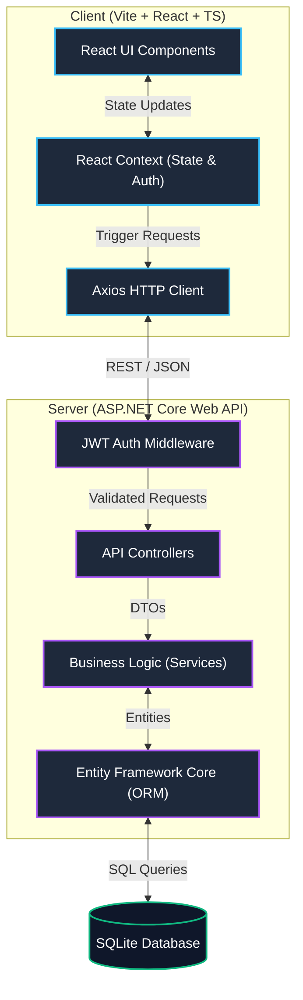
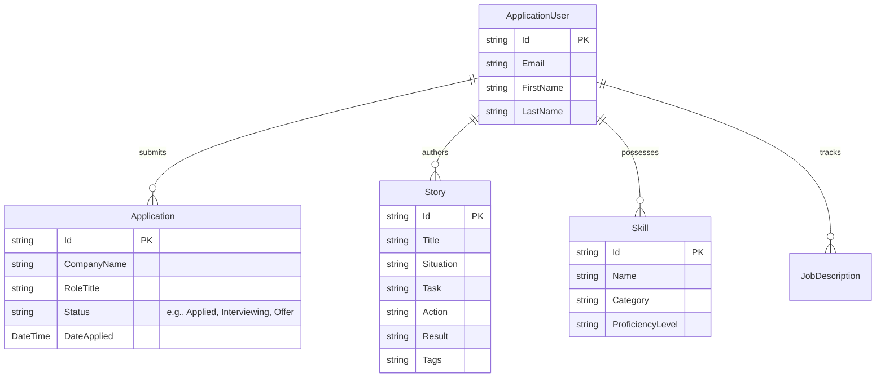

<div align="center">
  
# Precept

**A Private, Local-First Job-Hunting Command Center for Software Engineers**


Precept is a highly specialized, terminal-inspired Career OS designed strictly for developers. It moves beyond standard spreadsheets by introducing a localized system to manage STAR (Situation, Task, Action, Result) stories, track applications, and index technical skills—all behind a sleek, developer-first interface.

</div>

---

## 🚀 Why Precept?

Standard CRMs and spreadsheets are clunky and generalized. Precept was built to solve a specific pain point for software engineers: **organizing interview narratives and tracking the job hunt pipeline in an environment that feels like home.**

- **STAR Story Bank**: Curate, tag, and index your interview stories using the STAR method so you never freeze during a behavioral interview.
- **Pipeline Tracking**: A centralized dashboard to track active applications, follow-ups, and negotiation phases.
- **Skills Matrix**: Keep an up-to-date inventory of your technical capabilities and proficiencies to quickly match against job descriptions.
- **Local-First Architecture**: Your career data is highly personal. Precept leverages a local SQLite database to ensure your pipeline remains private, fast, and completely under your control.
- **Terminal Aesthetics**: A dark-mode, command-center UI built with TailwindCSS and Framer Motion that developers actually *want* to use.

---

## 🏗️ System Architecture

Precept follows a clean, decoupled client-server architecture, allowing for independent scaling and local deployment.



### Tech Stack

#### Frontend (Precept.Web)
- **Framework**: React 19 with TypeScript
- **Build Tool**: Vite (Lightning fast HMR)
- **Styling**: TailwindCSS with arbitrary custom properties
- **Animations**: Framer Motion
- **Icons**: Lucide React / Google Material Symbols
- **State Management**: React Context API
- **Routing**: React Router DOM

#### Backend (Precept.Api)
- **Framework**: ASP.NET Core Web API (.NET 10)
- **Language**: C#
- **ORM**: Entity Framework Core
- **Database**: SQLite (Local, self-contained)
- **Authentication**: JSON Web Tokens (JWT) & ASP.NET Core Identity

---

## 🛠️ Data Model Overview

The system revolves around four core domain entities tailored to the engineering job hunt:



---

## ⚙️ Local Development Setup

To run Precept locally, you'll need [Node.js](https://nodejs.org/) and the [.NET SDK](https://dotnet.microsoft.com/download) installed.

### 1. Clone the repository
```bash
git clone https://github.com/austinchima/precept.git
cd precept
```

### 2. Start the Backend API
```bash
cd Precept.Api
dotnet restore
dotnet run
```
*The API will typically boot on `https://localhost:7227` or `http://localhost:5177`.*

### 3. Start the Frontend Client
Open a new terminal window:
```bash
cd Precept.Web
npm install
npm run dev
```
*The frontend will boot on `http://localhost:3000`.*

---

## 🔐 Security & Privacy

Since Precept handles your personal career trajectory, security is treated as a first-class citizen:
- **Stateless Authentication**: Uses stateless JWTs with short expirations and refresh token rotation.
- **Local Isolation**: SQLite keeps your data entirely localized to your machine. No telemetry, no cloud sync unless explicitly configured.
- **Data Export**: Built-in raw JSON payload export functionality for immediate data portability.

---

<div align="center">
  <i>Engineered for the Modern Developer.</i>
</div>
