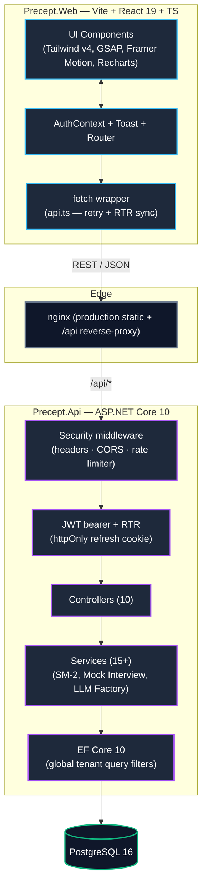
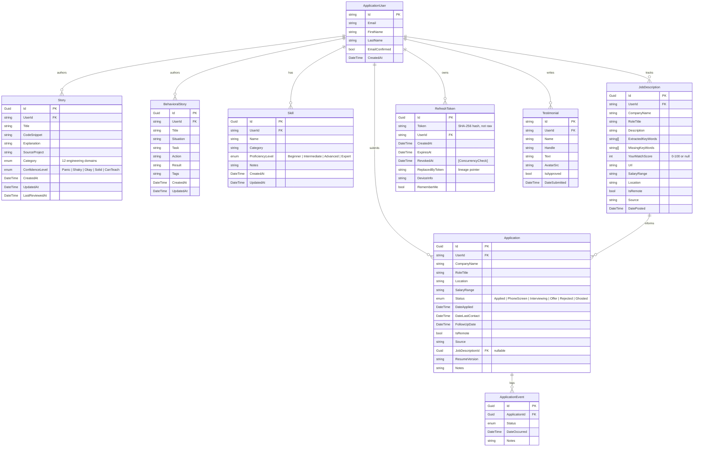

<div align="center">

# Precept

**A career command center for software engineers. Story bank, drill engine, and job pipeline tracker.**


</div>

Precept is a self-hostable web application that helps software engineers prepare for interviews
and run their job hunt as a structured project rather than a graveyard of browser tabs. It is
**developer-first**: dark-mode, monospace-leaning, keyboard-navigable (Cmd/Ctrl+K command palette), with actual security
posture and no telemetry. It is also a deliberate engineering artifact. The auth, testing, and
operational pieces are built to a higher bar than the feature surface strictly requires.

> **Status:** Production-ready with SuperMemo-2 (SM-2) active recall memory modeling, vendor-agnostic AI mock interview simulations, 1-click live demo sandbox, full-stack containerization, and 154 green unit/integration tests.

---

## ✦ Why this exists

Interview prep for engineers is fragmented across a Google Doc of STAR stories, a spreadsheet
of applications, twenty open JD tabs, and a vague mental model of "things I have built." Precept
collapses that into one application with three explicit jobs:

1. **Bank your stories**: technical (snippets and explanations, tagged across 12 engineering
   domains) and behavioral (STAR-structured). You walk into every round with a written corpus
   to draw from.
2. **Drill them until recall is automatic**: a Quiz Mode powered by the **SuperMemo-2 (SM-2)**
   spaced-repetition algorithm that computes per-story Ease Factors ($EF$), compounding intervals,
   and rates each story on a 5-rung *Confidence Ladder* (`Panic → Shaky → Okay → Solid → Can Teach`).
3. **Run the pipeline like a project**: every application moves through a five-stage status
   machine with automatic event history. Nothing goes stale and you always know what to chase.

The wedge against other tools (Teal, Huntr, Simplify) is the **second** job. Those track
applications; Precept also makes you interview-ready.

---

## ✦ What's in Precept (live)

| Module | What it does |
|---|---|
| **AI Mock Interview Studio** | Real-time speech-to-text (STT) voice drill studio. The multi-provider AI judge scores answers against the STAR method (Situation, Task, Action, Result), provides coaching, and generates model responses. |
| **SuperMemo-2 (SM-2) Drill Engine** | Cognitive decay scheduling algorithm computing dynamic Ease Factors ($EF$), compounding review intervals ($I_{n+1} = I_n \times EF$), streak tracking, and anti-clumping jitter. Prepared for deferred FSRS ML models. |
| **Technical Story Bank** | Catalog snippets + written explanations, tagged across 12 domains: `Auth`, `Database`, `Ai`, `Ml`, `DevOps`, `Frontend`, `Backend`, `SystemDesign`, `Security`, `Testing`, `Cloud`, `Architecture`. Each story carries a `ConfidenceLevel` and SM-2 metadata. |
| **Behavioral Story Bank** | STAR-method (Situation / Task / Action / Result) narratives with free-text tags and AI evaluation hooks. |
| **Instant Live Demo Mode** | One-click passwordless trial (`POST /api/auth/demo-login`) with pre-seeded technical stories, behavioral narratives, applications, and analytics. |
| **Google OAuth & Social Auth** | Streamlined authentication with Google OAuth integration alongside native JWT and Refresh Token Rotation (RTR). |
| **JD Skill Mapper** | Paste a job description. Precept auto-extracts a curated tech-skills keyword list server-side and computes a match score by case-insensitive set-intersection against the user's `Skills` inventory, surfacing missing keywords. |
| **Pipeline Tracker** | Five-stage status machine: `Applied → PhoneScreen → Interviewing → Offer / Rejected / Ghosted`. Every status change writes an `ApplicationEvent` for an auditable trajectory. |
| **Job Posting Capture** | One-click capture from any job posting page via a bookmarklet. The server fetches the URL, extracts company/role/location/salary/remote/description, creates a `JobDescription`, and seeds a draft `Application`. |
| **Skills Matrix** | Inventory with `Name`, `Category`, `ProficiencyLevel` (`Beginner / Intermediate / Advanced / Expert`), and notes. Feeds the JD match and the Technical Readiness radar. |
| **Analytics Dashboard** | Confidence trajectory curve, application velocity conversion funnel, story category breakdowns, response/rejection rates. Powered by `Recharts`. |
| **Technical Readiness** | Radar visualization of proficiency per skill category against an interview-ready threshold, plus JD-derived gap analysis. |
| **Search** | Cross-entity search over the user's stories, applications, JDs, and skills. |
| **Data Export** | `GET /api/dashboard/export` returns the user's entire data set as a JSON payload. No lock-in. |
| **Email Digests & Reminders** | Daily background service generating unified reminders for follow-ups and story reviews due via Resend and SMTP. |
| **Settings & Recovery** | Manage active sessions (with remote revocation) and recover soft-deleted items (Stories, Applications, Skills) from a 30-day trash view. |

All endpoints are user-scoped (`[Authorize]` + `WHERE UserId = current_user` at the query
layer) and rate-limited. The capture endpoint additionally validates the URL scheme,
rejects private/loopback hosts, and caps fetched pages at 2 MB.

---

## ✦ Architecture


```mermaid
graph TD
    classDef frontend fill:#1E293B,stroke:#38BDF8,stroke-width:2px,color:#fff;
    classDef backend  fill:#1E293B,stroke:#A855F7,stroke-width:2px,color:#fff;
    classDef database fill:#0F172A,stroke:#10B981,stroke-width:2px,color:#fff;
    classDef edge     fill:#0F172A,stroke:#64748B,stroke-width:2px,color:#fff;

    subgraph Client ["Precept.Web — Vite + React 19 + TS"]
        UI["UI Components<br/>(Tailwind v4, GSAP, Framer Motion, Recharts)"]:::frontend
        Ctx["AuthContext + Toast + Router"]:::frontend
        HTTP["fetch wrapper<br/>(api.ts — retry + RTR sync)"]:::frontend
    end

    subgraph Edge ["Edge"]
        NG["nginx (production static + /api reverse-proxy)"]:::edge
    end

    subgraph Server ["Precept.Api — ASP.NET Core 10"]
        SEC["Security middleware<br/>(headers · CORS · rate limiter)"]:::backend
        AUTH["JWT bearer + RTR<br/>(httpOnly refresh cookie)"]:::backend
        CTRL["Controllers (10)"]:::backend
        SVC["Services (15+)<br/>(SM-2, Mock Interview, LLM Factory)"]:::backend
        EF["EF Core 10<br/>(global tenant query filters)"]:::backend
    end

    DB[("PostgreSQL 16")]:::database

    UI <--> Ctx
    Ctx --> HTTP
    HTTP -->|REST / JSON| NG
    NG -->|/api/*| SEC
    SEC --> AUTH
    AUTH --> CTRL
    CTRL --> SVC
    SVC --> EF
    EF --> DB
```

### Tech stack — actually used

| Layer | What's in the repo |
|---|---|
| **Backend (`Precept.Api/`)** | ASP.NET Core Web API on **.NET 10**, C# 13, EF Core 10, Npgsql, ASP.NET Core Identity, JWT bearer, `System.Threading.RateLimiting`, **Serilog** (console + rolling file sink), **Scalar** for OpenAPI UI, `DotNetEnv` for local env loading, `IHttpClientFactory` for job-posting fetch. Universal AI client adapters for OpenAI, Anthropic, Gemini, Groq, DeepSeek, and local Ollama. |
| **Frontend (`Precept.Web/`)** | **React 19** + TypeScript on **Vite 6**, **Tailwind v4** (`@tailwindcss/vite`), **GSAP 3** + `@gsap/react`, **Framer Motion** / **motion**, **Recharts**, **lucide-react**, **lenis** (smooth scroll), `@paper-design/shaders-react`, native `fetch` (no axios), React Router 7. |
| **Database** | PostgreSQL 16 (Alpine in compose), schema versioned via EF Core migrations (committed to git). |
| **Tests (`Precept.Tests/`)** | **xUnit** + **Testcontainers for .NET 4.14.0** (Postgres per-class isolation in local runs; CI uses an action-provisioned Postgres service); **154 DB-backed integration + unit tests**. |
| **CI** | GitHub Actions (`.github/workflows/ci.yml`): build + test + `dotnet list package --vulnerable` + `npm run lint` + `npm audit --audit-level=moderate` on the web project. |
| **Containerization** | Multi-stage Dockerfiles for both projects; `docker-compose.yml` wires `db` → `api` → `web` with healthchecks. |

---

## ✦ Project layout

```
.
├── Precept.Api/                ASP.NET Core 10 web API
│   ├── Controllers/            10 controllers (Auth, Story, Application, JD, Skill, ...)
│   ├── Services/               12 services + helper classes (DI-registered, mostly scoped)
│   ├── Models/                 Domain entities + EF migrations source
│   ├── DTOs/                   Request/Response shapes
│   ├── Data/                   PreceptDbContext (with global tenant query filters)
│   ├── Migrations/             EF Core migrations (committed)
│   ├── appsettings.json        Non-secret config (secrets injected via env)
│   ├── Program.cs              Composition root + middleware pipeline
│   └── Dockerfile              Multi-stage (build / dev / final)
│
├── Precept.Web/                Vite + React 19 + TS frontend
│   ├── src/pages/              Route components (Landing, LoginPage, Dashboard, StoryBank, QuizMode, JDMatcher, Readiness, AppTracker, Settings)
│   ├── src/components/         UI + animation primitives
│   ├── src/lib/                animations.ts (GSAP wrappers), constants, utils, skills
│   ├── src/api.ts              fetch wrapper with token refresh interceptor
│   ├── src/AuthContext.tsx     React context for auth state
│   ├── nginx.conf              Production reverse-proxy config (/api → api:8080)
│   └── Dockerfile              build → nginx final stage
│
├── Precept.Tests/              xUnit test suite
│   ├── Integration/            Auth, Story, Application endpoint tests
│   ├── Unit/                   Story, Application, Token, CookieOptions services
│   └── Infrastructure/         PostgresContainerFixture, WebApplicationFactory
│
├── design-system/pages/        Static design references (UI exploration)
├── .github/workflows/ci.yml    Build + test + vulnerability scans
├── docker-compose.yml          db + api + web stack (local dev)
├── docker-compose.gcp.yml      db + api only (for cloud backend deployment)
├── auth_reuse_detection_cascade_revocation.md   Auth architecture handbook
└── CHANGELOG.md                Keep-a-Changelog format, semver
```

---

## ✦ Data model


```mermaid
erDiagram
    ApplicationUser ||--o{ Application       : submits
    ApplicationUser ||--o{ Story             : authors
    ApplicationUser ||--o{ BehavioralStory   : authors
    ApplicationUser ||--o{ Skill             : has
    ApplicationUser ||--o{ JobDescription    : tracks
    ApplicationUser ||--o{ RefreshToken      : owns
    ApplicationUser ||--o{ Testimonial       : writes
    Application     ||--o{ ApplicationEvent  : logs
    JobDescription  ||--o{ Application       : informs

    ApplicationUser {
        string  Id PK
        string  Email
        string  FirstName
        string  LastName
        bool    EmailConfirmed
        DateTime CreatedAt
    }

    Application {
        Guid     Id PK
        string   UserId FK
        string   CompanyName
        string   RoleTitle
        string   Location
        string   SalaryRange
        enum     Status "Applied | PhoneScreen | Interviewing | Offer | Rejected | Ghosted"
        DateTime DateApplied
        DateTime DateLastContact
        DateTime FollowUpDate
        bool     IsRemote
        string   Source
        Guid     JobDescriptionId FK "nullable"
        string   ResumeVersion
        string   Notes
    }

    ApplicationEvent {
        Guid     Id PK
        Guid     ApplicationId FK
        enum     Status
        DateTime DateOccurred
        string   Notes
    }

    Story {
        Guid     Id PK
        string   UserId FK
        string   Title
        string   CodeSnippet
        string   Explanation
        string   SourceProject
        enum     Category         "12 engineering domains"
        enum     ConfidenceLevel  "Panic | Shaky | Okay | Solid | CanTeach"
        DateTime CreatedAt
        DateTime UpdatedAt
        DateTime LastReviewedAt
    }

    BehavioralStory {
        Guid     Id PK
        string   UserId FK
        string   Title
        string   Situation
        string   Task
        string   Action
        string   Result
        string   Tags
        DateTime CreatedAt
        DateTime UpdatedAt
    }

    Skill {
        Guid     Id PK
        string   UserId FK
        string   Name
        string   Category
        enum     ProficiencyLevel "Beginner | Intermediate | Advanced | Expert"
        string   Notes
        DateTime CreatedAt
        DateTime UpdatedAt
    }

    JobDescription {
        Guid       Id PK
        string     UserId FK
        string     CompanyName
        string     RoleTitle
        string     Description
        string[]   ExtractedKeyWords
        string[]   MissingKeyWords
        int        YourMatchScore   "0-100 or null"
        string     Url
        string     SalaryRange
        string     Location
        bool       IsRemote
        string     Source
        DateTime   DatePosted
    }

    RefreshToken {
        Guid     Id PK
        string   Token            "SHA-256 hash, not raw"
        string   UserId FK
        DateTime CreatedAt
        DateTime ExpiresAt
        DateTime RevokedAt        "[ConcurrencyCheck]"
        string   ReplacedByToken  "lineage pointer"
        string   DeviceInfo
        bool     RememberMe
    }

    Testimonial {
        string   Id PK
        string   UserId FK
        string   Name
        string   Handle
        string   Text
        string   AvatarSrc
        bool     IsApproved
        DateTime DateSubmitted
    }
```

---

## ✦ Security posture

Precept handles personal career data; the security model is overbuilt on purpose. The
auth architecture is detailed in [auth_reuse_detection_cascade_revocation.md](./auth_reuse_detection_cascade_revocation.md). Highlights:

### Authentication & session management
- **Passwords**: PBKDF2 via ASP.NET Core Identity. Password policy: ≥8 chars, upper/lower/digit/non-alphanumeric.
- **Lockout**: 5 failed attempts locks the account for 15 minutes.
- **Email**: Registration sets `EmailConfirmed=false` and issues a confirmation token. `forgot-password` and `reset-password` flows use Identity's built-in token providers.
- **Access tokens**: JWT bearer, HMAC-SHA256, 15-minute expiry, zero clock skew.
- **Refresh tokens**: 64-byte CSPRNG, only SHA-256 hashes are persisted, set in an `HttpOnly` + `Secure` + `SameSite=Strict` cookie. Default 7-day expiry.
- **Refresh-token rotation (RTR)**: every refresh exchange invalidates the spent token and writes a new one in a single atomic `SaveChanges`. Spent tokens record their successor's hash (`ReplacedByToken`) to preserve family lineage.
- **Replay defense** ([deep dive](./auth_reuse_detection_cascade_revocation.md)):
  - **Lineage guard**: presenting a revoked token that is the direct parent of the active token within a 10-second grace window is treated as a benign concurrent retry (dual tabs / double-click) and yields a soft 401 the client interceptor recovers from silently.
  - **Cascade revocation**: presenting any other revoked token (older ancestor or across a broken lineage) is treated as a confirmed replay and revokes every active session for the identity.
  - **Optimistic concurrency**: the `RevokedAt` column carries `[ConcurrencyCheck]`, so two threads racing to rotate the exact same token at the same millisecond result in `DbUpdateConcurrencyException` for the loser instead of split-brain child tokens.
- **JWT key fail-fast**: `Program.cs` refuses to boot if `JwtSettings:SecretKey` is missing or shorter than 32 bytes (the HMAC-SHA256 minimum).

### Surface controls
- **Rate limiting**: `System.Threading.RateLimiting`: `auth` policy = 10 req/min, `general` policy = 100 req/min, both fixed-window with `QueueLimit=0` (fail-fast 429).
- **CORS**: Environment-gated. `AllowViteDev` in development. The `Production` policy reads allowed origins from the `CORS_ORIGINS` env var and only permits `Content-Type`, `Authorization`, `X-Requested-With` headers and a fixed verb set.
- **Security headers**: `X-Frame-Options: DENY`, `X-Content-Type-Options: nosniff`, `Referrer-Policy: strict-origin-when-cross-origin`, `Permissions-Policy` (deny camera/mic/geolocation/etc.), `Content-Security-Policy` (tightened for production).
- **Errors**: Exception detail (`exception.Message`) is returned only in `Development`. Production gets `"An unexpected error occurred."`. Stack traces go to structured logs.

### Data plane
- **Tenant isolation**: `PreceptDbContext` applies a global `HasQueryFilter` on `Application`, `ApplicationEvent`, and `Story` so they are automatically scoped to the current user. `BehavioralStory`, `JobDescription`, `Skill`, and `Testimonial` are scoped by `UserId` at the service/query layer.
- **No raw SQL**: all queries are EF Core LINQ. React auto-escapes the rendering layer.
- **Data portability**: `GET /api/dashboard/export` returns the user's entire data set as JSON.
- **Migrations on startup are gated**: `Database.Migrate()` only runs when `IsDevelopment()` or `RunMigrationsOnStartup=true`. Production deploys apply migrations explicitly.

### Known limitations
- Access tokens are transported in an `HttpOnly` cookie in production, but the refresh flow
  still relies on cookie and API coordination. Token revocation via cascade is fully implemented.
- No centralized audit log or SIEM forwarding.
- No artifact signing or SLSA provenance on container images yet.
- "Encryption at rest" is not an application-level feature. That is a property of the
  Postgres host you choose. Self-hosters should configure it on their database tier.

---

## ✦ Running locally

You need either **Docker Desktop** (the easy path) or **.NET 10 SDK** + **Node 20+** +
**PostgreSQL** (the manual path).

### Required environment variables

Create a `.env` file at the repo root for `docker compose`:

```bash
# Postgres
POSTGRES_USER=precept
POSTGRES_PASSWORD=replace-with-strong-password
POSTGRES_DB=precept

# JWT — must be at least 32 bytes; the API refuses to boot otherwise
# Generate one: openssl rand -hex 32
JWT_SECRET_KEY=your-32-byte-or-longer-secret-key

# Optional, prod-only
# Comma-separated list of allowed CORS origins (defaults to deny if unset in prod)
CORS_ORIGINS=https://your-domain.example
# Comma-separated allowed Host headers
ALLOWED_HOSTS=your-domain.example
```

### Path A: Docker Compose (recommended)

```bash
git clone https://github.com/austinchima/Precept.git
cd Precept
# Create the root .env file using the template in "Required environment variables" above,
# then start the stack:
docker compose up -d --build
```

| Service | URL |
|---|---|
| Web (production nginx build) | http://localhost |
| API (direct) | http://localhost:8080 |
| API health | http://localhost:8080/api/health |
| Postgres | internal only (not exposed to the host) |

> ⚠️ The `web` container serves the production build on **port 80**, not 3000. Port 3000 is
> only used by the Vite dev server (Path B).

### Path B: manual dev loop with hot reload

```bash
# Terminal 1 (DB)
docker run --rm -p 5432:5432 \
  -e POSTGRES_USER=precept -e POSTGRES_PASSWORD=dev -e POSTGRES_DB=precept \
  postgres:18-alpine

# Terminal 2 (API)
cd Precept.Api
export JWT_SECRET_KEY=$(openssl rand -hex 32)
export ConnectionStrings__DefaultConnection="Host=localhost;Database=precept;Username=precept;Password=dev"
dotnet watch run    # http://localhost:5xxx with Scalar UI at /scalar

# Terminal 3 (Web)
cd Precept.Web
npm install
npm run dev         # http://localhost:3000, Vite HMR
```

### Bookmarklet setup

Precept includes a zero-install bookmarklet for one-click job capture.

1. Open `http://localhost:3000/capture/index.html` (or `/capture/index.html` on your production domain).
2. Drag the **Capture to Precept** link to your browser's bookmarks bar.
3. While viewing any job posting, click the bookmark. Precept opens in a new tab,
   fetches the posting, extracts structured fields, and creates a draft application.

The bookmarklet source lives in `Precept.Web/public/capture/bookmarklet.js` and the
instruction page is `Precept.Web/public/capture/index.html`.

---

## ✦ Testing

The test suite uses **xUnit** + **Testcontainers for .NET** with per-test-class Postgres
isolation. Locally, `PostgresContainerFixture` spins up an ephemeral container; in CI it
attaches to the `ikalnytskyi/action-setup-postgres` service via the
`ConnectionStrings__PreceptDb` env var. The current suite runs 100+ tests.

```bash
# Run the whole suite (unit + integration)
dotnet test

# A single test class
dotnet test --filter "FullyQualifiedName~AuthEndpointTests"

# Frontend type-check
cd Precept.Web && npm run lint
```

CI (`.github/workflows/ci.yml`) runs on every push and PR to `master`:

1. `dotnet restore` / `build --configuration Release`
2. `dotnet test` against an action-provisioned Postgres
3. `dotnet list package --vulnerable --include-transitive` (OWASP A06)
4. `npm audit --audit-level=moderate` and `npm run build` for `Precept.Web` (OWASP A06)

EF Core migrations are committed to source control — CI applies them automatically via
`Database.Migrate()` against the per-test database.

---

## ✦ API documentation

In development, the OpenAPI schema is served at `/openapi/v1.json` and a **Scalar** UI is
mounted at `/scalar` — wire-level explorable docs for every endpoint, generated from the
controller `XML` doc-comments. Disabled in production by default.

---

## ✦ Roadmap

### R2: AI-assisted interview intelligence

The plan. The goal is not to ship an LLM wrapper. It is to ship LLM features
that are cheap, observable, and abuse-resistant under a freemium use pattern. The hard
constraint is unit economics:

| Constraint | Target |
|---|---|
| Marginal LLM cost per mock-interview session | ≤ **$0.005** end-to-end |
| Free-tier sessions per user | rate-limited to 2 / month |
| Paid extension | non-expiring credit packs, ledger-backed (atomic decrement, audit trail) |
| STT in free tier | browser-native Web Speech API (zero server cost) |
| TTS in free tier | `SpeechSynthesisUtterance` (zero server cost) |
| Spend kill switch | env-flag `AI_FEATURES_ENABLED` for one-config disable |

Planned features:
- **AI Mock Interviewer**: small-model question generation (Gemini Flash or Claude Haiku tier)
  tailored to the user's resume and a JD, with prompt caching for the static resume/JD context
  and a per-session token budget enforced server-side.
- **Voice mock rounds**: browser-native STT/TTS for free tier. Optional `whisper-1` for paid.
- **Scored feedback**: structured rubric (Structure / Specificity / Conciseness) returned per
  response and persisted against the relevant Story for the spaced-repetition loop.
- **Resume parser**: server-side PDF/DOCX → Skills inventory and JD match auto-fill.

Operational tooling that lands alongside R2: a per-user spend dashboard (`{user_id, session_id,
input_tokens, output_tokens, model, cost_usd}` ledger), an admin `/spend` page, and a CI
budget-regression check.

### R3: platform expansion

Aspirational; not in active development.
- Native desktop (Tauri) and a companion mobile client.
- Team Mode: shared story banks and peer mocks for engineering teams.

---

## ✦ Disclaimer & origin

Precept is a personal project. It is not a funded startup, not a hosted commercial service, and not affiliated with any employer. It exists because I was a new grad with no
internship experience trying to land my first SWE role, and a spreadsheet was not enough. If
you find it useful, run it yourself (`docker compose up -d --build`). It is MIT-licensed and
yours to fork.

The codebase intentionally over-invests in things hiring teams care about (auth correctness,
test isolation, OWASP coverage, observability) at the expense of feature breadth. That trade
is on purpose. See `auth_reuse_detection_cascade_revocation.md` for the receipts.

<div align="center">
<i>Built by a developer who needed it. MIT-licensed for anyone else who does.</i>
</div>
