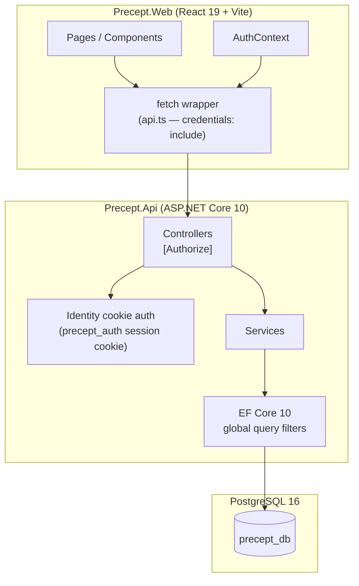
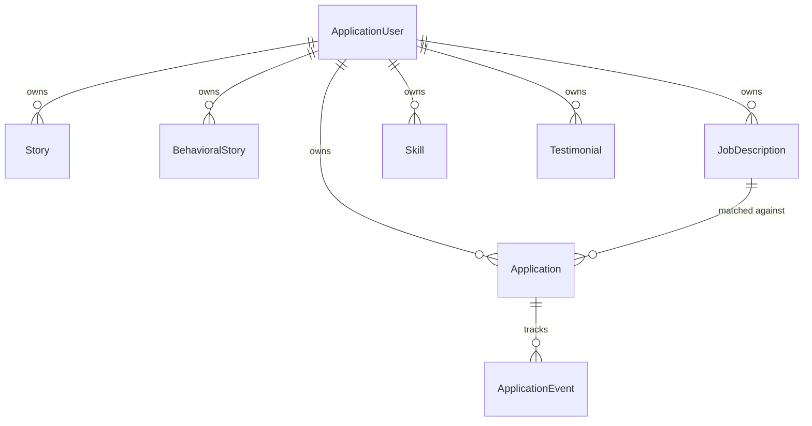

# Precept — the career command center for software engineers


Precept is a self-hostable job-search and career-prep platform. You own the database, you
run the stack, nobody sees your data but you. It tracks applications, stores behavioral
stories in STAR format, maps skills against job descriptions, and runs AI-assisted mock
interviews with spaced-repetition review scheduling — one coherent system instead of five
disconnected tools.

It is built for engineers who want a serious, auditable codebase on top of ASP.NET Core
Identity cookie authentication.

---

## Why this exists

Job hunting as an engineer means juggling a spreadsheet of applications, a folder of
resumes, a notes app of interview stories, and a prayer. Existing trackers (Teal, Huntr,
Simplify) handle the tracking half and stop there. None of them help you *prepare* —
actually get sharper for the interview — and all of them hold your career data on someone
else's infrastructure.

Precept closes that gap: a tracker that also coaches, running entirely on your own
hardware or a cheap VPS.

---

## Features

| Module | What it does |
| ------ | ------------ |
| **Application Tracker** | Kanban + list of applications, follow-up dates, status history, notes, resume version per application |
| **Behavioral Story Bank** | STAR stories with tags, confidence ratings, templates, and quiz mode |
| **Spaced Repetition** | SM-2 algorithm schedules story reviews so high-value stories surface before you forget them |
| **JD Skill Mapper** | Paste a job description; server-side keyword extraction scores your skills against it |
| **AI Mock Interviews** | Vendor-agnostic LLM client (OpenAI, Anthropic, Gemini, Groq, DeepSeek, Ollama) generates questions and scores STAR answers; browser-native STT/TTS |
| **Daily Digest Email** | Resend/SMTP email each morning with due reviews and upcoming follow-ups |
| **One-click Job Capture** | Bookmarklet scrapes a posting URL into a draft application |
| **Settings & Recovery** | Sign out of all other devices (security-stamp revocation) and recover soft-deleted items |

---

## Tech stack

| Layer | Choice |
| ----- | ------ |
| Backend | ASP.NET Core 10 Web API, EF Core 10, ASP.NET Core Identity cookie auth, `System.Threading.RateLimiting` |
| Frontend | React 19, TypeScript, Vite, Tailwind CSS v4, GSAP, Framer Motion, Recharts, lucide-react, React Router 7 |
| Database | PostgreSQL 16 (containerized), EF Core migrations |
| Email | Resend API with SMTP fallback |
| Observability | Serilog (console + rolling file), Scalar OpenAPI in dev |
| Testing | xUnit, FluentAssertions, WebApplicationFactory, Testcontainers.PostgreSql |
| DevOps | Docker Compose, GitHub Actions CI |

---

## Architecture


```mermaid
graph TB
    subgraph Frontend["Precept.Web (React 19 + Vite)"]
        UI["Pages / Components"]:::frontend
        HTTP["fetch wrapper<br/>(api.ts — credentials: include)"]:::frontend
        CTX["AuthContext"]:::frontend
    end

    subgraph Backend["Precept.Api (ASP.NET Core 10)"]
        AUTH["Identity cookie auth<br/>(precept_auth session cookie)"]:::backend
        CTRL["Controllers<br/>[Authorize]"]:::backend
        SVC["Services"]:::backend
        EF["EF Core 10<br/>global query filters"]:::backend
    end

    subgraph Data["PostgreSQL 16"]
        DB[(precept_db)]:::data
    end

    UI --> HTTP --> CTRL
    CTX --> HTTP
    CTRL --> AUTH
    CTRL --> SVC --> EF --> DB
```


```mermaid
erDiagram
    ApplicationUser ||--o{ Application       : owns
    ApplicationUser ||--o{ Story             : owns
    ApplicationUser ||--o{ BehavioralStory   : owns
    ApplicationUser ||--o{ JobDescription    : owns
    ApplicationUser ||--o{ Skill             : owns
    ApplicationUser ||--o{ Testimonial       : owns
    JobDescription  ||--o{ Application       : "matched against"
    Application     ||--o{ ApplicationEvent  : tracks
```

---

## Project layout

```
├── Precept.Api/                ASP.NET Core 10 Web API
│   ├── Controllers/            Auth, Application, Story, Dashboard, Search, Skill,
│   │                           JobDescription, BehavioralStory, MockInterview, Testimonial
│   ├── Services/               Business logic + Interfaces/
│   ├── Models/                 Entity models
│   ├── DTOs/                   Request/response contracts
│   ├── Data/                   PreceptDbContext (global per-user query filters)
│   ├── Migrations/             EF Core migrations
│   └── Dockerfile
│
├── Precept.Web/                React 19 + TypeScript + Vite
│   ├── src/pages/              Dashboard, Applications, Stories, Quiz, JDs, Readiness,
│   │                           MockInterview, Settings, Login, Landing
│   ├── src/components/         UI + animation primitives
│   ├── src/lib/                animations.ts + utilities
│   ├── src/api.ts              fetch wrapper (credentials: include, CSRF header)
│   ├── src/AuthContext.tsx     React context for auth state
│   ├── nginx.conf              Production reverse-proxy config (/api → api:8080)
│   └── Dockerfile              build → nginx final stage
│
├── Precept.Tests/              xUnit test suite
│   ├── Integration/            Auth, Story, Application endpoint tests
│   ├── Unit/                   Story, Application, Digest, Search, Skill services
│   └── Infrastructure/         WebApplicationFactory + Testcontainers fixture
│
├── docker-compose.yml          db + api + web, zero-config boot
├── docker-compose.gcp.yml      GCP-flavoured variant
├── design-system/              Design tokens and reference styles
├── auth_reuse_detection_cascade_revocation.md   Auth design-history artifact (superseded in M1)
├── OWASP-SECURITY-AUDIT.md     Full OWASP Top-10 audit
├── CHANGELOG.md
└── README.md
```

---

## Getting started

### Prerequisites

- Docker + Docker Compose, **or** .NET 10 SDK + Node 20+ for local development
- (Optional) an LLM API key for mock-interview features

### Path A — Docker (recommended)

```bash
git clone https://github.com/austinchima/Precept.git
cd Precept
cp .env.example .env      # edit values if you like; defaults work locally
docker compose up --build
```

The frontend is served by nginx on **http://localhost:80**. The API listens internally on
`api:8080` and is proxied by nginx under `/api`.

### Path B — Local development

```bash
# Postgres
docker run -d --name precept-db -p 5432:5432 \
  -e POSTGRES_USER=postgres -e POSTGRES_PASSWORD=postgres -e POSTGRES_DB=precept_db \
  postgres:16-alpine

# API
cd Precept.Api
export ConnectionStrings__DefaultConnection="Host=localhost;Database=precept_db;Username=postgres;Password=postgres"
dotnet run        # http://localhost:8080 — Scalar UI at /scalar in Development

# Web
cd ../Precept.Web
npm install
npm run dev       # http://localhost:3000 — Vite dev server, proxies /api
```

### Environment variables

```bash
# Postgres
POSTGRES_USER=postgres
POSTGRES_PASSWORD=postgres
POSTGRES_DB=precept_db

# (JWT_SECRET_KEY is no longer needed — cookie auth uses Data Protection keys.)

# CORS / hosts (production)
CORS_ORIGINS=https://app.example.com
ALLOWED_HOSTS=*

# Email (optional)
RESEND_API_KEY=
RESEND_FROM_EMAIL=coach@precept.app
SMTP_HOST= / SMTP_PORT= / SMTP_USERNAME= / SMTP_PASSWORD= / SMTP_FROM_EMAIL=

# AI (optional — mock interviews)
AI_PROVIDER=Auto            # Auto | OpenAI | Claude | Gemini | Groq | DeepSeek | Ollama | Custom
AI_MODEL=gpt-4o-mini
AI_API_KEY= / OPENAI_API_KEY= / ANTHROPIC_API_KEY= / GEMINI_API_KEY=
AI_BASE_URL=                # e.g. http://localhost:11434/v1 for Ollama
```

---

## Security

Precept handles personal career data; the security model is overbuilt on purpose.
(The earlier refresh-token design is preserved in
[auth_reuse_detection_cascade_revocation.md](./auth_reuse_detection_cascade_revocation.md)
as a superseded design-history artifact.) Highlights:

- **Session cookies**: ASP.NET Core Identity cookie authentication. The `precept_auth` cookie is `HttpOnly` + `Secure` + `SameSite=Strict` (Lax outside production), with a 14-day expiration and sliding renewal — no client-side token handling at all.
- **Sliding sessions**: every authenticated request can extend the session, so active users stay signed in for up to 14 days of inactivity without any refresh-token dance.
- **Global sign-out**: `UpdateSecurityStampAsync` rotates the user's security stamp; `SecurityStampValidator` rejects cookies minted under the old stamp. Powers `POST /api/auth/sign-out-everywhere`, password resets, and account deletion.
- **CSRF defense**: `SameSite=Strict` is the primary control; additionally, all mutating `/api/*` requests must carry the `X-Requested-With: XMLHttpRequest` header (cross-site forms cannot set custom headers).
- **Data Protection**: cookie payloads are encrypted and signed by ASP.NET Core Data Protection — no shared JWT signing secret (`JWT_SECRET_KEY`) to manage or rotate.
- **Passwords**: PBKDF2 via ASP.NET Core Identity. Lockout: 5 failed attempts → 15 minutes.
- **Rate limiting**: `auth` policy 10 req/min sliding window; `general` 100 req/min fixed window, applied per controller.
- **Row-level tenancy**: every domain entity carries a global `HasQueryFilter` scoped to the requesting user, in addition to explicit service-layer WHERE clauses.
- **CORS**: Environment-gated. `AllowViteDev` in development. The `Production` policy reads allowed origins from the `CORS_ORIGINS` env var and only permits `Content-Type`, `Authorization`, `X-Requested-With` headers and a fixed verb set.
- **Headers**: `X-Frame-Options`, `X-Content-Type-Options`, `Referrer-Policy`, CSP, `Permissions-Policy` on every response; production error responses redact exception details.
- **SSRF guard** on the job-capture endpoint: URL scheme validation, private/loopback host rejection, 2 MB page cap.

See [OWASP-SECURITY-AUDIT.md](./OWASP-SECURITY-AUDIT.md) for the full audit.

---

## Testing

```bash
dotnet test        # xUnit + Testcontainers (spins up PostgreSQL automatically)
```

- **Unit tests** cover SM-2 scheduling math, story/application/digest/search/skill services, and LLM factory resolution.
- **Integration tests** boot the real API via `WebApplicationFactory` against a per-class Testcontainers PostgreSQL database (or `ConnectionStrings__PreceptDb` in CI) and exercise the full HTTP surface: register → login → cookie session → logout, lockout, sign-out-everywhere, CSRF header enforcement, and every domain endpoint.
- CI (GitHub Actions) runs the suite plus `dotnet list package --vulnerable` and `npm audit`.

---

## API documentation

With the API running in **Development**, browse the interactive Scalar UI at
`http://localhost:8080/scalar`. OpenAPI JSON is at `/openapi/v1.json`.

---

## Roadmap

- **R1 (shipped)** — tracker, story bank, JD matcher, security baseline.
- **R1.5 (shipped)** — SM-2 spaced repetition, AI mock interviews, digest emails, demo mode.
- **M1 (this branch)** — authentication simplification: Identity cookie auth replaces the hand-rolled JWT/RTR stack.
- **R2 candidates** — scoped programmatic API tokens (MCP/CLI access), NLP-based JD keyword extraction, FSRS scheduler, per-session AI cost ceilings (≤ $0.005), credit ledger with atomic decrement, `AI_FEATURES_ENABLED` kill switch.

### R2 scope notes

- **AI Mock Interviewer**: small-model question generation (Gemini Flash or Claude Haiku tier)
  tailored to the user's resume and a JD, with prompt caching for the static resume/JD context
  and a per-session token budget enforced server-side.
- **Voice mock rounds**: browser-native STT/TTS for free tier. Optional `whisper-1` for paid.
- **Scored feedback**: structured rubric (Structure / Specificity / Conciseness) returned per
  response and persisted against the relevant Story for the spaced-repetition loop.
- **Resume parser**: upload → extract → prefill profile. Small-model summarization only; no
  embeddings store in v1.

### Known limitations

- Email delivery requires a Resend key or SMTP relay; without one, password-reset tokens are
  logged to the server console in Development only.
- No programmatic API tokens yet (e.g. for MCP/CLI access); cookie auth is browser-oriented.
  Scoped API tokens are future work.
- Single-node deployment: Data Protection keys are ephemeral by default in containers;
  mount a persistent key ring for multi-replica or restart-surviving sessions.
- No centralized audit log / SIEM integration.

---

## Disclaimer & origin

Precept is a personal portfolio project, not a funded SaaS — there is no hosted commercial
offering (yet). The codebase deliberately over-invests in auth, testing, and OWASP coverage
because that is the point: it demonstrates production-grade engineering judgment on a
realistic, non-trivial domain.

## License

MIT — see [LICENSE](./LICENSE).
