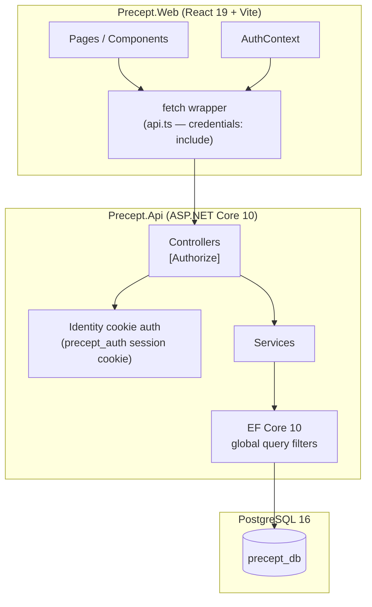
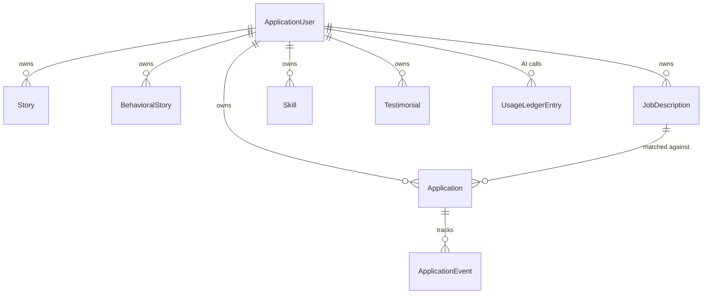

# Precept — the career command center for software engineers


Precept is a self-hostable job-search and career-prep platform. You own the database and
run the stack. AI features send the text they work on to the LLM provider you configure;
everything else stays in your database. It tracks applications, stores behavioral
stories in STAR format, maps skills against job descriptions, and runs AI-assisted mock
interviews with spaced-repetition review scheduling — one coherent system instead of five
disconnected tools.

It is built for engineers who want a serious, auditable codebase on top of ASP.NET Core
Identity cookie authentication.

---

## Why this exists

Job hunting as an engineer means juggling a spreadsheet of applications, a folder of
resumes, a notes app of interview stories, and a prayer. Existing trackers (Teal, Huntr,
Simplify) handle the tracking half and stop there. None of them help you *prepare* —
actually get sharper for the interview — and all of them hold your career data on someone
else's infrastructure.

Precept closes that gap: a tracker that also coaches, running entirely on your own
hardware or a cheap VPS.

---

## Features

| Module | What it does |
| ------ | ------------ |
| **Application Tracker** | Kanban + list of applications, follow-up dates, status history, notes, resume version label per application |
| **Behavioral Story Bank** | STAR stories with tags, confidence ratings, templates, and quiz mode |
| **Spaced Repetition** | SM-2 algorithm schedules story reviews so high-value stories surface before you forget them |
| **JD Skill Mapper** | Paste a job description; a server-side dictionary keyword extractor finds known skills and scores them against your skills by exact name match |
| **AI Mock Interviews** | Vendor-agnostic LLM client (OpenAI, Anthropic and Gemini clients, plus OpenAI-compatible endpoints such as Groq, DeepSeek and Ollama) generates questions and scores STAR answers; speech-to-text runs in the browser |
| **Daily Digest Email** | Resend/SMTP email each morning with due reviews and upcoming follow-ups |
| **One-click Job Capture** | Bookmarklet scrapes a posting URL into a draft application |
| **Settings** | Sign out of all other devices (security-stamp revocation) and delete your account. Deleted stories and applications are soft-deleted and can be restored through the API; there is no trash screen yet |

---

## Tech stack

| Layer | Choice |
| ----- | ------ |
| Backend | ASP.NET Core 10 Web API, EF Core 10, ASP.NET Core Identity cookie auth, `System.Threading.RateLimiting` |
| Frontend | React 19, TypeScript, Vite, Tailwind CSS v4, GSAP, Framer Motion, Recharts, lucide-react, React Router 7 |
| Database | PostgreSQL 16 in `docker-compose.yml` (`docker-compose.gcp.yml` uses 18), EF Core migrations |
| Email | Resend API with SMTP fallback |
| Observability | Serilog (console + rolling file), Scalar OpenAPI in dev |
| Testing | xUnit, FluentAssertions, NSubstitute, WebApplicationFactory, Testcontainers.PostgreSql |
| DevOps | Docker Compose, GitHub Actions CI, GitHub Actions deploy of the API to Google Cloud Run |

---

## Architecture


```mermaid
graph TB
    subgraph Frontend["Precept.Web (React 19 + Vite)"]
        UI["Pages / Components"]:::frontend
        HTTP["fetch wrapper<br/>(api.ts — credentials: include)"]:::frontend
        CTX["AuthContext"]:::frontend
    end

    subgraph Backend["Precept.Api (ASP.NET Core 10)"]
        AUTH["Identity cookie auth<br/>(precept_auth session cookie)"]:::backend
        CTRL["Controllers<br/>[Authorize]"]:::backend
        SVC["Services"]:::backend
        EF["EF Core 10<br/>global query filters"]:::backend
    end

    subgraph Data["PostgreSQL 16"]
        DB[(precept_db)]:::data
    end

    UI --> HTTP --> CTRL
    CTX --> HTTP
    CTRL --> AUTH
    CTRL --> SVC --> EF --> DB
```


```mermaid
erDiagram
    ApplicationUser ||--o{ Application       : owns
    ApplicationUser ||--o{ Story             : owns
    ApplicationUser ||--o{ BehavioralStory   : owns
    ApplicationUser ||--o{ JobDescription    : owns
    ApplicationUser ||--o{ Skill             : owns
    ApplicationUser ||--o{ Testimonial       : owns
    ApplicationUser ||--o{ UsageLedgerEntry  : "AI calls"
    JobDescription  ||--o{ Application       : "matched against"
    Application     ||--o{ ApplicationEvent  : tracks
```

---

## Design decisions

The choices below are the ones a reviewer is most likely to ask about. Each lists what was
chosen, why, and its known weak spot. Longer-form records are planned in `docs/adr/`
(plan item S-Q5).

### 1. Tenancy through EF Core global query filters

**Decision.** Every user-owned entity has a `UserId` and a `HasQueryFilter` that limits
queries to the signed-in user (`Precept.Api/Data/PreceptDbContext.cs`). Services still add
their own `WHERE UserId = ...`; the filter is a second line of defence.

**Why.** In a multi-tenant app the expensive bug is one user reading another user's data.
A forgotten `WHERE` in a new endpoint becomes an empty result instead of a data leak.

**Weak spot.** The filter reads the user from a context property on every query. Copying the
user ID into a local variable first would bake the first caller's ID into EF's cached model
and silently apply it to everyone; the code comment in `PreceptDbContext` explains this.
System jobs (cleanup, digests) must call `IgnoreQueryFilters()` deliberately. Integration
tests check that one user cannot read, change or delete another user's stories or applications.

### 2. Session cookie instead of JWT

**Decision.** ASP.NET Core Identity cookie auth: an `HttpOnly`, `Secure`, `SameSite=Strict`
cookie with a 14-day sliding expiry (`Program.cs`, section 4). An earlier JWT and
refresh-token design was replaced in 1.3.0 and is kept in `docs/archive/`.

**Why.** The only client is a browser on the same site. A cookie keeps the token away from
JavaScript, needs no refresh-token rotation code, and rotating the user's security stamp
signs out every session at once (used by "sign out everywhere", password reset and account
deletion).

**Weak spot.** Cookies are encrypted with ASP.NET Data Protection keys, which are
in-memory by default in a container. A restart or a second instance logs everyone out until
the keys are persisted (plan item M1-F4). Cookie auth also does not suit a CLI or API
clients; scoped API tokens are future work.

### 3. Per-visitor demo accounts

**Decision.** "Try the demo" creates a fresh seeded account per visitor that expires after
24 hours, has no password, and never calls an AI provider
(`Precept.Api/Services/DemoAccountService.cs`, `DemoCleanupService.cs`). Creation is
rate-limited per client IP.

**Why.** It replaced one shared demo login whose password was in source: visitors could see
and change each other's data, and anyone could spend the AI budget.

**Weak spot.** Behind a proxy such as Cloud Run every request comes from the proxy's address,
so the per-IP limit becomes one shared bucket. The opt-in `ForwardedHeaders:TrustAllProxies`
setting takes the client IP from the right-most `X-Forwarded-For` entry; enabling it where
clients can reach the API directly would let them spoof their IP.

### 4. Every AI call is metered

**Decision.** Application code can only get an `ILlmClient` from `ILlmClientFactory`, which
returns a `MeteredLlmClient` (`Precept.Api/Services/Usage/`). Its only method requires a
usage context (user, feature, prompt version). It refuses demo users, checks per-user daily
and monthly limits and a global daily cap, calls the provider, and writes a `UsageLedger`
row for every attempt, failed calls included.

**Why.** An LLM call costs real money per request. Making the limit check part of the only
call path means a new feature cannot forget it.

**Weak spot.** Check and record are separate steps, so two requests arriving together at the
limit can both pass; the overshoot is at most the number of concurrent requests. No model
prices are built in because they change, so the USD budget only covers models given a price
in configuration; the daily call cap always applies.

### 5. Integration tests against real PostgreSQL

**Decision.** Tests run against PostgreSQL in Docker through Testcontainers
(`Precept.Tests/Infrastructure/`). Each test class gets its own database, created and
migrated with the real migrations, and `WebApplicationFactory` boots the real API for HTTP
tests.

**Why.** An in-memory provider would not catch PostgreSQL-specific behaviour: SQL
translation of the query filters, `ILIKE` search, cascade deletes, numeric types, or a
migration that does not apply. These tests also exercise the cookie, CSRF header and
rate-limit middleware end to end.

**Weak spot.** The suite needs Docker and takes about a minute. There are no frontend tests
yet (plan item M1-F9).

### 6. Nothing on screen is invented

**Decision.** The UI only shows numbers computed from the user's data, and empty states when
there is not enough data. Earlier sample-data charts, hard-coded testimonials and claims
about features that did not exist were removed (see the CHANGELOG).

**Why.** The product asks engineers to be precise about their own work; it should hold
itself to the same standard.

**Weak spot.** Some planned views, such as a confidence trend over time, stay hidden until
the review history they need exists (plan items M3-F4 and S7).

---

## Project layout

```
├── Precept.Api/                ASP.NET Core 10 Web API
│   ├── Controllers/            Auth, Application, Story, Dashboard, Search, Skill,
│   │                           JobDescription, BehavioralStory, MockInterview,
│   │                           Testimonial, System
│   ├── Services/               Business logic + Interfaces/
│   ├── Models/                 Entity models
│   ├── DTOs/                   Request/response contracts
│   ├── Data/                   PreceptDbContext (global per-user query filters)
│   ├── Migrations/             EF Core migrations
│   └── Dockerfile
│
├── Precept.Web/                React 19 + TypeScript + Vite
│   ├── src/pages/              Dashboard, AppTracker, StoryBank, QuizMode, JDMatcher,
│   │                           Readiness, MockInterview, Capture, Settings, LoginPage,
│   │                           Landing, TermsOfService
│   ├── src/components/         UI + animation primitives
│   ├── src/lib/                animations.ts + utilities
│   ├── src/api.ts              fetch wrapper (credentials: include, CSRF header)
│   ├── src/AuthContext.tsx     React context for auth state
│   ├── nginx.conf              Production reverse-proxy config (/api → api:8080)
│   └── Dockerfile              build → nginx final stage
│
├── Precept.Tests/              xUnit test suite
│   ├── Integration/            Auth, Story, Application, Dashboard, Search, Skill,
│   │                           MockInterview endpoint tests
│   ├── Unit/                   Services, SM-2, keyword and page extractors, LLM factory
│   └── Infrastructure/         WebApplicationFactory + Testcontainers fixture
│
├── docker-compose.yml          db + api + web, zero-config boot
├── docker-compose.gcp.yml      GCP-flavoured variant
├── design-system/              Design tokens and reference styles
├── docs/
│   ├── plan/                   Implementation plan, status tracker, agent prompt
│   ├── research/               Market and product strategy research
│   └── archive/                Superseded planning and design docs
├── PRECEPT_OVERVIEW.md         Product overview
├── CHANGELOG.md
└── README.md
```

---

## Getting started

### Prerequisites

- Docker + Docker Compose, **or** .NET 10 SDK + Node 20+ for local development
- (Optional) an LLM API key for mock-interview features

### Path A — Docker (recommended)

```bash
git clone https://github.com/austinchima/Precept.git
cd Precept
cp .env.example .env      # edit values if you like; defaults work locally
docker compose up --build
```

The frontend is served by nginx on **http://localhost:80**. The API listens internally on
`api:8080` and is proxied by nginx under `/api`.

### Path B — Local development

```bash
# Postgres
docker run -d --name precept-db -p 5432:5432 \
  -e POSTGRES_USER=postgres -e POSTGRES_PASSWORD=postgres -e POSTGRES_DB=precept_db \
  postgres:16-alpine

# API
cd Precept.Api
export ConnectionStrings__DefaultConnection="Host=localhost;Database=precept_db;Username=postgres;Password=postgres"
dotnet run        # http://localhost:8080 — Scalar UI at /scalar in Development

# Web
cd ../Precept.Web
npm install
npm run dev       # http://localhost:3000 — Vite dev server, proxies /api
```

### Environment variables

```bash
# Postgres
POSTGRES_USER=postgres
POSTGRES_PASSWORD=postgres
POSTGRES_DB=precept_db

# (JWT_SECRET_KEY is no longer needed — cookie auth uses Data Protection keys.)

# CORS / hosts (production)
CORS_ORIGINS=https://app.example.com
ALLOWED_HOSTS=*

# Email (optional)
RESEND_API_KEY=
RESEND_FROM_EMAIL=coach@precept.app
SMTP_HOST= / SMTP_PORT= / SMTP_USERNAME= / SMTP_PASSWORD= / SMTP_FROM_EMAIL=

# AI (optional — mock interviews)
AI_PROVIDER=Auto            # Auto | OpenAI | Claude | Gemini | Groq | DeepSeek | Ollama | Custom
AI_MODEL=gpt-4o-mini
AI_API_KEY= / OPENAI_API_KEY= / ANTHROPIC_API_KEY= / GEMINI_API_KEY=
AI_BASE_URL=                # e.g. http://localhost:11434/v1 for Ollama

# AI usage limits (API settings, defaults shown). Every AI call is checked against these
# and recorded in the UsageLedger table. Over a user limit the API returns 402; over a
# global cap it returns 503 and logs a critical alert.
AiSettings__MaxOutputTokens=1500
Usage__Features__mock_question__PerDay=20
Usage__Features__mock_question__PerMonth=200
Usage__Features__mock_evaluate__PerDay=20
Usage__Features__mock_evaluate__PerMonth=200
Usage__GlobalDailyCallLimit=500
Usage__GlobalDailyBudgetUsd=10
# Prices are not built in. Copy them from your provider's current price page, per model
# (USD per million tokens). Unpriced models are limited by the daily call cap only.
Usage__ModelPrices__<model-name>__InputPerMillionUsd=
Usage__ModelPrices__<model-name>__OutputPerMillionUsd=

# Demo accounts (optional API settings, defaults shown). docker-compose.yml does not
# forward these; set them on the API process or container if you need to change them.
Demo__LifetimeHours=24
Demo__MaxCreationsPerIpPerHour=5
Demo__CleanupIntervalMinutes=60
# Behind a reverse proxy that appends X-Forwarded-For (for example Cloud Run), set this so
# per-IP rate limits see real client IPs. Leave unset if clients can reach the API directly.
ForwardedHeaders__TrustAllProxies=false
```

---

## Security

Precept handles personal career data. Known security gaps are tracked as milestone M1 in
[docs/plan/PRECEPT_PLAN.md](./docs/plan/PRECEPT_PLAN.md).
(The earlier refresh-token design is preserved in
[docs/archive/auth_reuse_detection_cascade_revocation.md](./docs/archive/auth_reuse_detection_cascade_revocation.md)
as a superseded design-history artifact.) Highlights:

- **Session cookies**: ASP.NET Core Identity cookie authentication. The `precept_auth` cookie is `HttpOnly` + `Secure` + `SameSite=Strict` (Lax outside production), with a 14-day expiration and sliding renewal — no client-side token handling at all.
- **Sliding sessions**: every authenticated request can extend the session, so active users stay signed in for up to 14 days of inactivity without any refresh-token dance.
- **Global sign-out**: `UpdateSecurityStampAsync` rotates the user's security stamp; `SecurityStampValidator` rejects cookies minted under the old stamp. Powers `POST /api/auth/sign-out-everywhere`, password resets, and account deletion.
- **CSRF defense**: `SameSite=Strict` is the primary control; additionally, all mutating `/api/*` requests must carry the `X-Requested-With: XMLHttpRequest` header (cross-site forms cannot set custom headers).
- **Data Protection**: cookie payloads are encrypted and signed by ASP.NET Core Data Protection — no shared JWT signing secret (`JWT_SECRET_KEY`) to manage or rotate.
- **Passwords**: PBKDF2 via ASP.NET Core Identity. Lockout: 5 failed attempts → 15 minutes.
- **Rate limiting**: `auth` policy 10 req/min sliding window; `general` 100 req/min fixed window, applied per controller. Both are currently single global buckets (not partitioned by user or IP).
- **Row-level tenancy**: every domain entity carries a global `HasQueryFilter` scoped to the requesting user, in addition to explicit service-layer WHERE clauses.
- **CORS**: Environment-gated. `AllowViteDev` in development. The `Production` policy reads allowed origins from the `CORS_ORIGINS` env var and only permits `Content-Type`, `Authorization`, `X-Requested-With` headers and a fixed verb set.
- **Headers**: `X-Frame-Options`, `X-Content-Type-Options`, `Referrer-Policy`, CSP, `Permissions-Policy` on every response; production error responses redact exception details.
- **SSRF guard** on the job-capture endpoint: URL scheme validation, private/loopback check on the requested host, 10-second timeout, 2 MB page cap. Redirect and DNS hardening is planned (M1-F7).

---

## Testing

```bash
dotnet test        # xUnit + Testcontainers (spins up PostgreSQL automatically)
```

- **Unit tests** cover SM-2 scheduling math, story/application/digest/search/skill services, and LLM factory resolution.
- **Integration tests** boot the real API via `WebApplicationFactory` against a per-class Testcontainers PostgreSQL database (or `ConnectionStrings__PreceptDb` in CI) and exercise the full HTTP surface: register → login → cookie session → logout, lockout, sign-out-everywhere, CSRF header enforcement, and every domain endpoint.
- CI (GitHub Actions) runs the suite plus `dotnet list package --vulnerable`, `npm audit` and a frontend type check (`npm run lint`, which runs `tsc --noEmit`).
- There are no frontend tests yet (planned as M1-F9).

---

## API documentation

With the API running in **Development**, browse the interactive Scalar UI at
`http://localhost:8080/scalar`. OpenAPI JSON is at `/openapi/v1.json`.

---

## Roadmap

The current plan is [docs/plan/PRECEPT_PLAN.md](./docs/plan/PRECEPT_PLAN.md), with progress in
[docs/plan/PLAN_STATUS.md](./docs/plan/PLAN_STATUS.md). Shipped so far: tracker, story bank, JD
matcher, SM-2 spaced repetition, AI mock interviews, digest emails, demo mode, and (1.3.0)
Identity cookie authentication in place of the earlier JWT and refresh-token design.

### Known limitations

- Email delivery requires a Resend key or SMTP relay; without one, password-reset tokens are
  logged to the server console in Development only.
- No programmatic API tokens yet (e.g. for MCP/CLI access); cookie auth is browser-oriented.
  Scoped API tokens are future work.
- Single-node deployment: Data Protection keys are ephemeral by default in containers;
  mount a persistent key ring for multi-replica or restart-surviving sessions.
- No centralized audit log / SIEM integration.
- Search covers applications, technical stories and skills, not behavioral stories or job
  descriptions.

---

## Disclaimer & origin

Precept is a personal portfolio project, not a funded SaaS — there is no hosted commercial
offering (yet). The codebase deliberately over-invests in auth, testing, and OWASP coverage
because that is the point: it demonstrates production-grade engineering judgment on a
realistic, non-trivial domain.

## License

MIT — see [LICENSE](./LICENSE).
