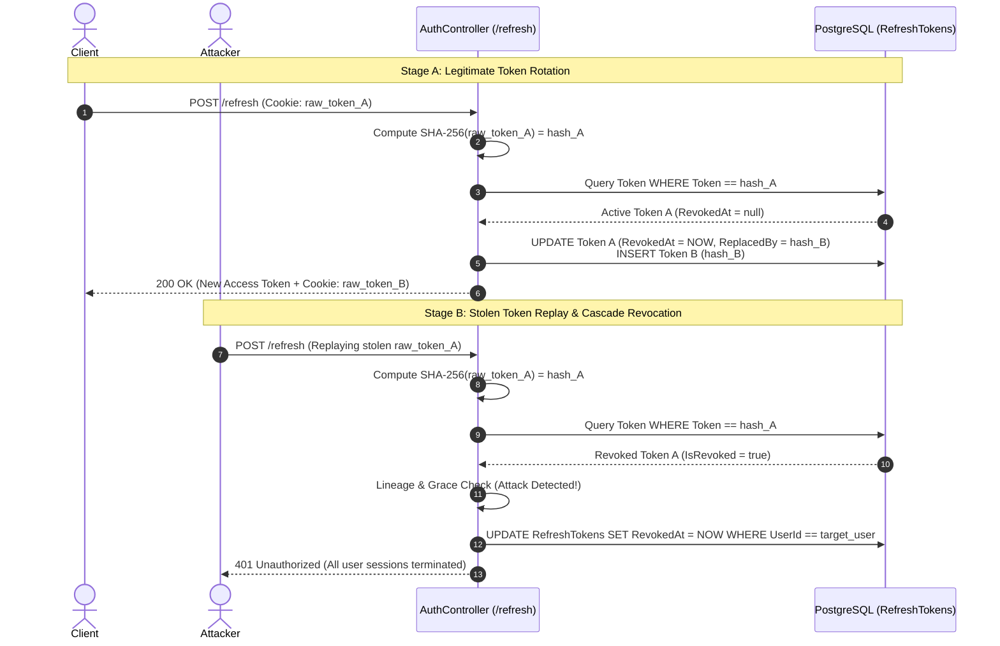

# Authentication Security Handbook: Refresh Token Rotation & Reuse-Detection Cascade Revocation

> [!IMPORTANT]
> This document details Precept's "Crown Jewel" authentication security architecture: **Database-Backed Refresh Token Rotation with Lineage-Aware Reuse-Detection Cascade Revocation**.

---

## 1. Executive Summary

Modern single-page applications (SPAs) like Precept require long-lived sessions without compromising on strict security boundaries. Standard short-lived JWT access tokens (e.g., 15 minutes) mitigate exposure window risks, but refreshing them via long-lived bearer tokens introduces a severe vulnerability: **if a refresh token is exfiltrated by an attacker (via XSS, network interception, or malware), the attacker gains persistent unauthorized access.**

To neutralize this threat, Precept implements **Refresh Token Rotation (RTR)** coupled with **Automated Reuse-Detection Cascade Revocation**. Every time a refresh token is exchanged for a new session, it is immediately invalidated and replaced by a cryptographic successor. If an invalidated token is ever presented again to the API, the system assumes a replay attack or token theft has occurred and instantly terminates **all active sessions across all devices** for that user identity.

---

## 2. Cryptographic Storage & Database Schema

Refresh tokens are generated as 64-byte cryptographically secure random values (`Convert.ToBase64String`) in [TokenService.cs](file:///E:/Personal%20Projects/Precept/Precept.Api/Services/TokenService.cs). 

Crucially, **raw refresh tokens are never persisted in the database**. The API computes a SHA-256 hash (`HashToken`) before storage. When a client authenticates, the incoming token from the secure HTTP-only cookie is hashed in memory and looked up via an indexed query.

### Entity Definition ([RefreshToken.cs](file:///E:/Personal%20Projects/Precept/Precept.Api/Models/RefreshToken.cs))

```csharp
public class RefreshToken
{
    [Key]
    public Guid Id { get; set; } = Guid.NewGuid();

    [Required, MaxLength(128)]
    public string Token { get; set; } = string.Empty; // SHA-256 Hash

    [Required]
    public string UserId { get; set; } = string.Empty;

    public DateTime CreatedAt { get; set; } = DateTime.UtcNow;
    public DateTime ExpiresAt { get; set; }

    [ConcurrencyCheck]
    public DateTime? RevokedAt { get; set; }

    [MaxLength(128)]
    public string? ReplacedByToken { get; set; } // Family Lineage Pointer

    [MaxLength(512)]
    public string? DeviceInfo { get; set; }
}
```

---

## 3. The Refresh & Cascade Revocation Workflow

When a client initiates `POST /api/auth/refresh` ([AuthController.cs](file:///E:/Personal%20Projects/Precept/Precept.Api/Controllers/AuthController.cs#L149)), the API executes a strict 5-stage verification lifecycle:



### Cascade Revocation Execution

When reuse is confirmed, `RevokeAllUserTokens` is invoked immediately:

```csharp
private async Task RevokeAllUserTokens(string userId)
{
    var activeTokens = await dbContext.RefreshTokens
        .Where(rt => rt.UserId == userId && rt.RevokedAt == null)
        .ToListAsync();

    foreach (var token in activeTokens)
    {
        token.RevokedAt = DateTime.UtcNow;
    }

    await dbContext.SaveChangesAsync();
}
```

> [!NOTE]
> **Architectural Scope Distinction**: Notice the query filters on `rt.UserId == userId`. While our replay detection phase is strictly **Lineage-Aware** (using `ReplacedByToken` to trace parent-child lineages and filter out benign concurrent tab retries), the revocation action itself is intentionally **Identity-Wide**. Under OWASP Fail-Safe design principles, a confirmed token theft on Device A (e.g., laptop) assumes the user's underlying machine or credentials are compromised. Terminating all active sessions (phone, tablet) forces a clean authentication challenge across all devices to neutralize lateral attacker movement.

---

## 4. Resolving Usability Traps: The Three Pillars

A naive implementation of reuse detection introduces severe usability flaws during **concurrent multi-tab navigation** (e.g., refreshing two browser tabs simultaneously) or **dead-heat network races** (two concurrent network retries hitting the database within the same millisecond). 

Precept solves these race conditions through three architectural safeguards:

### Pillar I: Lineage Guard
Before triggering a destructive cascade revocation, the API checks whether the replayed token is the **direct parent** of the currently active session token (`storedToken.ReplacedByToken == activeToken.Token`) and was revoked within a **10-second grace window**.
* If **True**: It is treated as a benign network retry. The API suppresses cascade revocation and returns a gentle `401 Unauthorized` (`"Token just refreshed"`), allowing the client HTTP interceptor to retry or synchronize.
* If **False** (e.g., replaying a token two generations old `A -> B -> C`): The grace window is ignored, and full family cascade revocation fires.

### Pillar II: Optimistic Concurrency on `RevokedAt`
By annotating `RevokedAt` with `[ConcurrencyCheck]`, Entity Framework Core appends `WHERE RevokedAt IS NULL` to the SQL `UPDATE` statement. If two identical concurrent requests race to rotate the same token, the first succeeds. The second updates 0 rows, triggering a `DbUpdateConcurrencyException`.

### Pillar III: Single-Save Atomic Rotation
The revocation of parent token $A$ and the creation of child token $B$ occur within a **single atomic `SaveChangesAsync()` transaction**. If a concurrency exception is caught during this save, the uncommitted child token evaporates, and the API safely returns a benign retry response.

---

## 5. Security Guarantees & Verification Suite

This implementation guarantees:
1. **Zero Phantom Sessions**: Even under extreme network concurrency, no dead-heat race can spawn split-brain child tokens.
2. **Immediate Breach Containment**: A single replayed token exfiltrates zero data and instantly locks down the compromised identity account.
3. **Zero Token Leakage at Rest**: Database backups or SQL injection vulnerabilities yield only unusable SHA-256 hashes.

The mechanism is continuously validated by Precept's integration test suite across 4 dedicated test invariants:
* `DeadHeatGuard`: Forces parallel simultaneous requests and asserts exact token count invariants.
* `NonParentReplay`: Simulates deep multi-generation replay chains (`A -> B -> C`) and asserts family-wide invalidation.
* `ReplayAfterWindow`: Asserts immediate cascade revocation once the 10s grace threshold expires.
* `CookieSecurity`: Asserts strict `HttpOnly`, `Secure`, and `SameSite=Strict` cookie headers in production environments.
